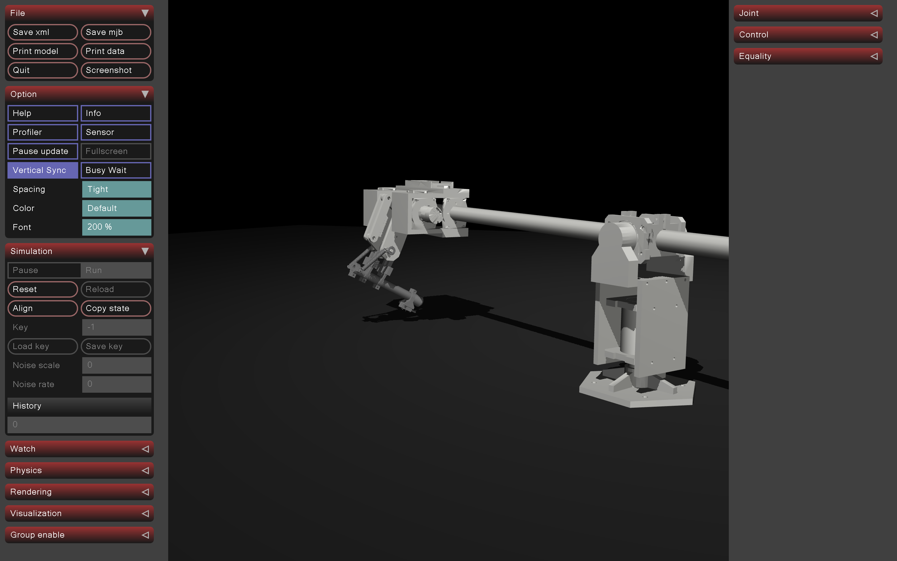
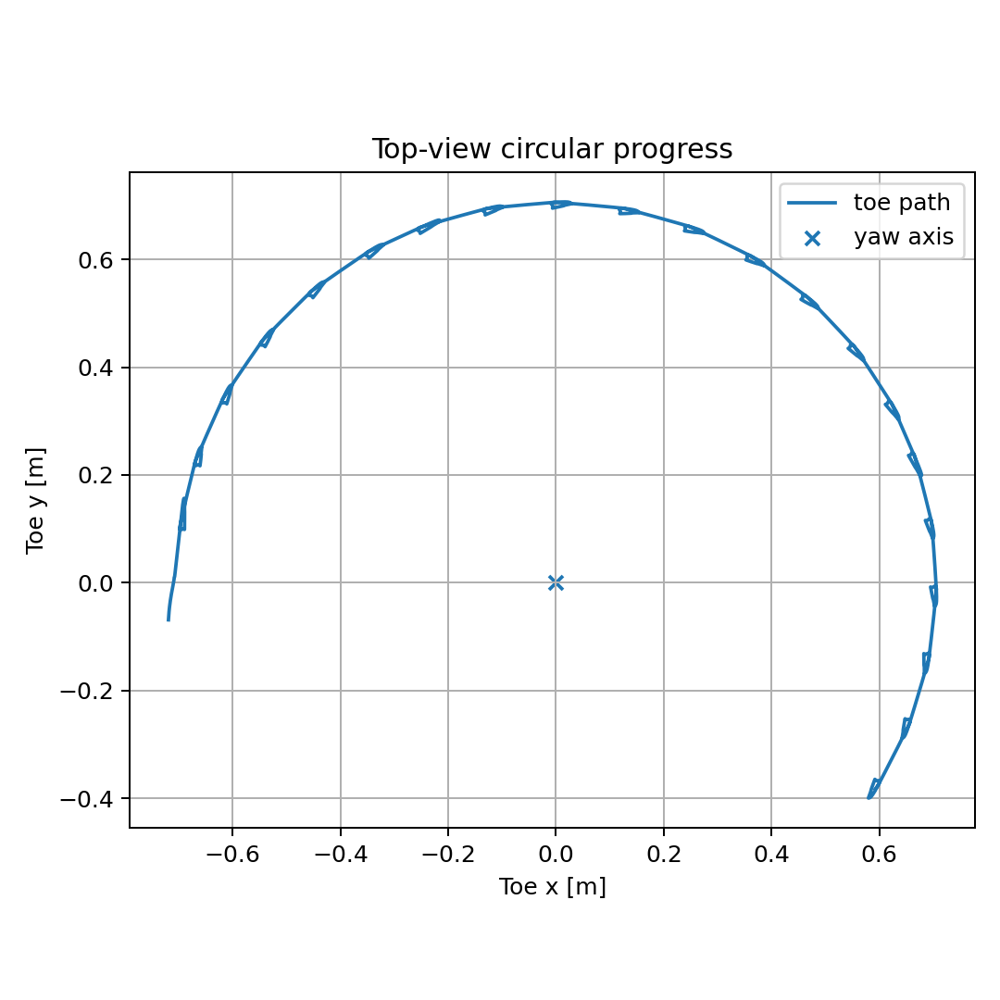
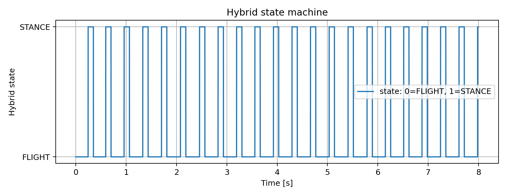
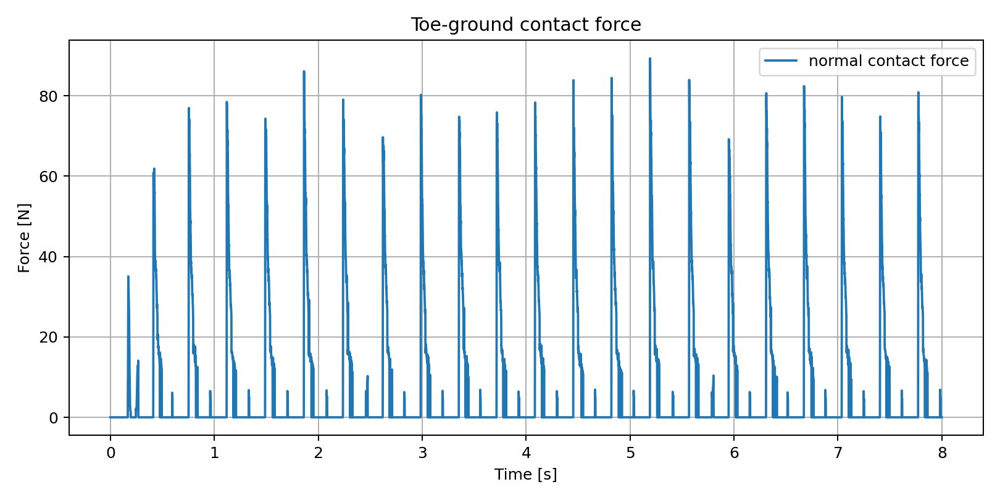
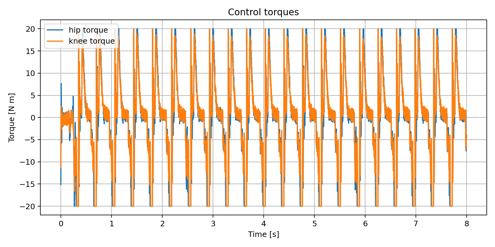

# HOPPY — MuJoCo Simulation (Team 1)

A MuJoCo-based simulation of the HOPPY single-legged hopping robot mounted on a boom gantry. The robot hops in a circle around the yaw axis using only hip and knee motors — the yaw joint stays passive the whole time.

---

## What it does

HOPPY uses a hybrid FLIGHT/STANCE controller to generate forward circular motion. During STANCE, the leg pushes tangentially against the ground to spin around the boom. During FLIGHT, the foot swings forward to set up the next touchdown. No yaw motor is needed — the tangential ground reaction force does all the propulsion.

The controller handles:
- **Stance:** Bézier-shaped vertical GRF + tangential force feedback + radial foot-hold correction
- **Flight:** Cartesian impedance control on the toe to clear the ground and pre-position for landing
- **Torque saturation:** Enforced on both hip and knee based on motor speed limits
- **Velocity estimation:** Encoder quantization + first-order lowpass filter (no gyro needed)

---

## Simulation viewer



---

## Results

### Circular path (top view)
The toe traces a clean arc around the yaw axis at a boom radius of ~556 mm.



### Hybrid state machine
Consistent FLIGHT/STANCE switching throughout the run. Stance duration ~105–175 ms, minimum flight time ~240 ms.



### Contact force
Peak normal contact force stabilizes around 80–90 N per hop after the first few cycles.



### Control torques
Both motors stay within the ±20 Nm saturation limit throughout the run.



---

## Key parameters

All in [`hoppy/params.py`](hoppy/params.py):

| Parameter | Value | Effect |
|---|---|---|
| `TARGET_YAW_RATE` | 0.58 rad/s | How fast it goes around the boom |
| `TANGENTIAL_FORCE_FF` | 78 N | Feed-forward push during stance |
| `T_STANCE` | 0.122 s | Nominal stance duration |
| `MIN_FLIGHT_TIME` | 0.24 s | Prevents rapid chatter hops |
| `CIRCLE_DIRECTION` | -1.0 | Clockwise (-1) or counter-clockwise (+1) |
| `FZ_BEZIER` | [0, 360, 920, 460, 0] | Vertical GRF profile (5-point Bézier) |

To make it go faster, raise `TARGET_YAW_RATE` or `TANGENTIAL_FORCE_FF` gradually. To make it hop higher, scale up `FZ_BEZIER` — but too much will cause the leg to over-extend.

---

## Setup

```bash
pip install -r requirements.txt
```

Requirements: Python 3.10+, MuJoCo ≥ 3.2, NumPy, Matplotlib, Pandas.

---

## Running

Basic simulation (no viewer, saves CSV + plots to `results/`):

```bash
python simulate.py --duration 6
```

With the MuJoCo viewer:

```bash
python simulate.py --duration 25 --viewer
```

With the collision debug model:

```bash
python simulate.py --duration 25 --viewer --xml models/hoppy_collision_debug.xml
```

Run validation checks (checks hop timing and yaw progress):

```bash
python validate_sim.py --duration 25
```

Disable specific physical effects for comparison runs:

```bash
python simulate.py --no-armature --no-damping --no-knee-spring --output-prefix no_dynamics
```

---

## Project structure

```
.
├── hoppy/
│   ├── controller.py     # HoppyHybridController (FLIGHT + STANCE)
│   ├── params.py         # All tuning parameters
│   ├── bezier.py         # Bézier curve evaluation for GRF shaping
│   ├── filters.py        # Encoder quantization + velocity estimator
│   └── mjcf_utils.py     # XML path helpers and override utilities
├── models/
│   ├── hoppy.xml                    # Main MJCF model
│   └── hoppy_collision_debug.xml    # Collision geometry visualization
├── simulate.py           # Entry point — runs sim and saves results
├── validate_sim.py       # Checks that hop timing and yaw progress are sane
├── plot_results.py       # Generates all plots from a simulation CSV
└── results/              # Auto-generated CSVs and plots
```

---

## Controller types

The project implements and compares several control strategies for the hopping behavior:

### 1. Hybrid FLIGHT/STANCE (main controller)
The one actually running in `simulate.py`. Two sub-controllers that hand off to each other based on contact force:
- **FLIGHT sub-controller** — Cartesian impedance on the toe position. Lifts the foot early in flight, swings it forward, then pulls it back right before touchdown so it lands under the hip instead of way out front
- **STANCE sub-controller** — Jacobian-transpose force control. Pushes up with a Bézier-shaped vertical GRF and tangentially to drive yaw progress. A radial correction keeps the foot from sliding sideways

### 2. Feed-forward only (baseline)
Removing the feedback terms (`KP_YAW_VEL = 0`, `KP_ST` zeroed) gives a pure feed-forward stance. Useful for seeing how far the robot gets without any error correction — it tends to drift in radius and eventually loses rhythm

### 3. No torque saturation
Running with `--no-torque-saturation` removes the motor limits. The robot hops higher and faster but the torques are physically unrealistic — good for finding the theoretical ceiling of the trajectory

### 4. Physical effects disabled
Flags like `--no-armature`, `--no-damping`, and `--no-knee-spring` strip out the rotor inertia, back-EMF damping, and passive knee spring one by one. Each one changes how snappy the leg responds and lets you see which physical effect matters most for stability

---

## How the controller works

The state machine is simple: the robot starts in FLIGHT. It switches to STANCE when the normal contact force exceeds 0.5 N (after a minimum flight time). It switches back to FLIGHT when the force drops below 0.25 N or the stance time exceeds the maximum.

In **STANCE**, the controller computes a desired 3D foot force (vertical Bézier + tangential propulsion + radial correction) and maps it to joint torques via the foot Jacobian transpose. A position feedback loop on hip/knee keeps the leg from collapsing mid-stance.

In **FLIGHT**, the controller runs a Cartesian impedance law on the toe position to lift the foot during early flight and bring it forward and down for the next touchdown. A postural term keeps hip/knee in a compact configuration.

A small passive guide torque on the yaw DOF biases the direction of rotation without replacing the locomotion generated by the leg.
